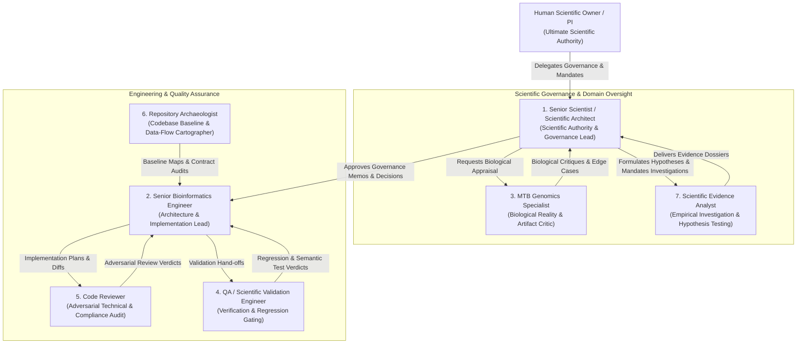

# BrSeqTB Virtual Scientific Software Team

This directory defines the operational roles, authority boundaries, skill compositions, and collaborative workflows of the BrSeqTB virtual scientific software team.

BrSeqTB is scientific software for *Mycobacterium tuberculosis* (MTB) whole-genome sequencing analysis. Computational correctness and biological validity are inseparable. To maintain strict scientific integrity, development is organized as a multidisciplinary team with separated powers rather than autonomous, unconstrained bots.

---

## 1. The Seven Agent Roles

| Agent File | Role Name | Authority Domain | Primary Skill |
|---|---|---|---|
| [senior-scientist.md](file:///home/falat/Repositories/BrSeqTB/agents/senior-scientist.md) | Senior Scientist / Scientific Architect | Scientific governance, decision classification, method gating | `skills/scientific-architect` |
| [senior-bioinformatics-engineer.md](file:///home/falat/Repositories/BrSeqTB/agents/senior-bioinformatics-engineer.md) | Senior Bioinformatics Engineer | Software architecture, Nextflow DSL2 implementation, reproducibility | `skills/bioinformatics-engineer` |
| [mtb-genomics-specialist.md](file:///home/falat/Repositories/BrSeqTB/agents/mtb-genomics-specialist.md) | MTB Genomics Specialist | Biological plausibility, MTB edge cases, resistance mechanisms | `skills/mtb-genomics-specialist` |
| [qa-scientific-validation-engineer.md](file:///home/falat/Repositories/BrSeqTB/agents/qa-scientific-validation-engineer.md) | QA / Scientific Validation Engineer | Test harness design, baseline regression gating, semantic validation | `skills/qa-validation` |
| [code-reviewer.md](file:///home/falat/Repositories/BrSeqTB/agents/code-reviewer.md) | Code Reviewer | Adversarial code audit, boundary checks, Nextflow/shell robustness | `skills/code-reviewer` |
| [repository-archaeologist.md](file:///home/falat/Repositories/BrSeqTB/agents/repository-archaeologist.md) | Repository Archaeologist | Legacy codebase discovery, data-flow mapping, contract baseline | `skills/repository-archaeologist` |
| [scientific-evidence-analyst.md](file:///home/falat/Repositories/BrSeqTB/agents/scientific-evidence-analyst.md) | Scientific Evidence Analyst | Empirical hypothesis testing, caller discordance, BAM/VCF audits | `skills/scientific-evidence-analyst` |

---

## 2. Core Operational Principles

1. **Separation of Powers**:
   - Scientific questions belong to the **Senior Scientist**.
   - Biological critique is provided by the **MTB Specialist**.
   - Implementation is executed by the **Senior Bioinformatics Engineer**.
   - Verification and regression testing are gated by **QA**.
   - Code quality and boundary audits are enforced by the **Code Reviewer**.
   - Baseline legacy truth is excavated by the **Repository Archaeologist**.
   - Empirical experimentation is conducted by the **Scientific Evidence Analyst**.

2. **No Silent Drift**:
   - No agent may independently alter protected scientific boundaries (allele frequency, variant quality, mapping quality, coverage thresholds, reference coordinates, resistance catalogues, phylogenetic models, masking, or NTM rules).

3. **Artifact-Driven Collaboration**:
   - Agents communicate via persistent repository artifacts stored under `docs/work/` and `docs/science/` rather than volatile conversational memory. Every finding, plan, diff, review, and test result must be documented with immutable references and commands.

4. **Mandatory Escalation**:
   - Ambiguity, genotype-phenotype discordance, caller disagreement, and missing decision records MUST trigger formal escalation rather than speculative heuristics or majority-vote LLM consensus.
