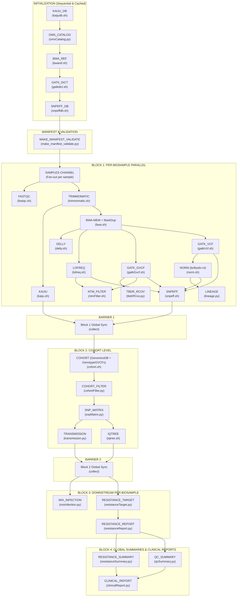

# Software Archeology & Environment Baseline: BrSeqTB

**Document ID**: `ARCH-BASE-001`  
**Repository**: `LaPAM-USP/BrSeqTB`  
**Date of Assessment**: August 13, 2026  
**Pipeline Framework**: Nextflow DSL2  
**Primary Target Organism**: *Mycobacterium tuberculosis* (H37Rv / NC_000962.3)  
**Primary Application**: Whole-Genome Sequencing (WGS) antimicrobial resistance inference, lineage typing, QC, mixed infection detection, cohort variant analysis, phylogenetics, and clinical reporting.

---

## Table of Contents

1. [Executive Summary & System Identification](#1-executive-summary--system-identification)
2. [Python Version & Runtime Environment](#2-python-version--runtime-environment)
3. [Conda / Mamba Environment Specification](#3-conda--mamba-environment-specification)
4. [Pip Requirements & Python Package Matrix](#4-pip-requirements--python-package-matrix)
5. [Docker Containerization Baseline](#5-docker-containerization-baseline)
6. [Singularity / Apptainer Containerization Baseline](#6-singularity--apptainer-containerization-baseline)
7. [Workflow Engine: Nextflow DSL2 Architecture](#7-workflow-engine-nextflow-dsl2-architecture)
8. [External Bioinformatic Binaries Matrix](#8-external-bioinformatic-binaries-matrix)
9. [Reference Databases & Static Assets](#9-reference-databases--static-assets)
10. [Configuration Files](#10-configuration-files)
11. [CLI Entry Points & Script Inventory](#11-cli-entry-points--script-inventory)
12. [Example Datasets & Input Validation Rules](#12-example-datasets--input-validation-rules)
13. [Test Datasets, Verification Runs & Quality Assurance](#13-test-datasets-verification-runs--quality-assurance)

---

## 1. Executive Summary & System Identification

**BrSeqTB** is a modular Nextflow DSL2 bioinformatics pipeline designed for comprehensive analysis of *Mycobacterium tuberculosis* whole-genome sequencing (WGS) data starting from Illumina paired-end FASTQ reads.

```
┌────────────────────────────────────────────────────────────────────────────┐
│                              BrSeqTB Pipeline                              │
├─────────────────┬───────────────────────────────┬──────────────────────────┤
│ Core Engine     │ Nextflow DSL2 (>= 25.10.2)    │ Workflow Orchestration   │
│ Environment     │ Conda / Bioconda / Forge      │ envs/brseqtb.yml         │
│ Core Language   │ Python 3.10 + Bash            │ Modular bin/ executables │
│ Reference       │ M. tuberculosis H37Rv         │ NC_000962.3 (4.41 Mb)    │
│ Resistance DB   │ WHO TB Catalogue (2023 v2)    │ WHO-UCN-TB-2023.7-eng    │
│ Target Systems  │ Linux x86_64, macOS, HPC/SLURM│ Standard, LowMem, HPC    │
└─────────────────┴───────────────────────────────┴──────────────────────────┘
```

The pipeline integrates quality control, taxonomic screening, alignment, variant calling across multiple callers, structural variant detection, variant annotation, WHO resistance profiling, mixed-infection inference, lineage typing, cohort-level variant aggregation, phylogenetic inference, transmission clustering, and automated Word-format clinical reporting.

---

## 2. Python Version & Runtime Environment

### 2.1 Pinned Pipeline Version
* **Target Python Version**: `Python 3.10` (as defined in [envs/brseqtb.yml](file:///home/falat/Repositories/BrSeqTB/envs/brseqtb.yml#L14)).
* **Host Runtime Detected**: `Python 3.14.3` (`/home/falat/.local/share/mise/shims/python`).
* **Architecture**: `x86_64-linux-gnu`.

> [!NOTE]
> Python 3.10 is strictly recommended because several bioconda binary dependencies (e.g. `pysam=0.22`, `vt`, `lofreq`, `snpeff`) rely on C-extension wheels with maximum stability on Python 3.10.

### 2.2 Standard Library Dependencies Used
Across all 13 Python scripts in [bin/](file:///home/falat/Repositories/BrSeqTB/bin):
* `argparse` — CLI argument parsing (`make_manifest_validate.py`, `clinicalReport.py`).
* `csv` — Comma/tab-delimited reading and writing.
* `collections` (`defaultdict`, `Counter`) — Frequency tracking and grouping.
* `datetime` — Timestamping clinical and summary reports.
* `gc` — Garbage collection management during large matrix generation.
* `gzip` — Direct streaming of compressed FASTQ and VCF files.
* `os`, `sys`, `pathlib.Path` — File system path resolution and exit codes.
* `re` — Regular expression matching for FASTQ headers, variants, and annotations.
* `typing` (`List`, `Dict`, `Tuple`, `Optional`, `Set`) — Type hints.

---

## 3. Conda / Mamba Environment Specification

### 3.1 Environment Definition File: `envs/brseqtb.yml`
* **Environment Name**: `brseqtb`
* **Channels**:
  * `conda-forge`
  * `bioconda`
* **Channel Priority**: `strict`

```yaml
name: brseqtb

channels:
  - conda-forge
  - bioconda

channel_priority: strict

dependencies:
  # Core
  - python=3.10
  - pip
  - bc
  - curl
  - wget
  - unzip
  - parallel
  - pigz

  # Alignment / HTS
  - bwa=0.7.17
  - samtools=1.18
  - bcftools=1.18
  - htslib=1.18
  - tabix

  # Variant callers / normalization
  - gatk4
  - picard
  - delly
  - lofreq
  - vt=2015.11.10

  # Java tools
  - openjdk=17
  - snpeff=5.2

  # QC / phylogeny / taxonomy
  - fastqc
  - trimmomatic
  - iqtree
  - kaiju
  - krona

  # Python scientific stack
  - numpy
  - pandas
  - networkx
  - biopython
  - pysam
  - openpyxl
  - xlsxwriter
  - python-docx
```

### 3.2 Automated Conda Cache in Nextflow
Nextflow creates and caches the environment automatically at:
```groovy
conda {
  enabled  = true
  useMamba = false
  cacheDir = "$HOME/.nextflow_conda_cache"
}
```

### 3.3 Anaconda Channel Terms of Service (TOS)
For unattended Conda environment instantiation, the Anaconda terms of service must be pre-accepted:
```bash
conda tos accept --override-channels --channel https://repo.anaconda.com/pkgs/main
conda tos accept --override-channels --channel https://repo.anaconda.com/pkgs/r
```

### 3.4 Manual Environment Creation Commands
```bash
# Create environment manually with Conda or Mamba
conda env create -f envs/brseqtb.yml -n brseqtb

# Activate
conda activate brseqtb

# Update/Prune
conda env update -f envs/brseqtb.yml --prune
```

---

## 4. Pip Requirements & Python Package Matrix

For container builds or non-Conda virtualenv setups, the following Python package matrix is required:

| Package | Imported Module | Purpose in BrSeqTB |
| :--- | :--- | :--- |
| `numpy` | `numpy` | Matrix operations, AF distributions, numeric depth filtering |
| `pandas` | `pandas` | Manifest processing, WHO catalogue filtering, QC aggregation, resistance summarization |
| `networkx` | `networkx` | Pairwise SNP distance graph construction & transmission network clustering |
| `biopython` | `Bio.SeqIO` | FASTA alignment reading/writing for IQ-TREE and SNP matrix generation |
| `pysam` | `pysam` | BAM indexed coverage parsing (`tbdrRCov.py`), VCF/Tabix extraction |
| `openpyxl` | `openpyxl` | Ingestion of `input_table.xlsx` and `WHO-UCN-TB-2023.7-eng.xlsx` |
| `xlsxwriter` | `xlsxwriter` | Formatted multi-sheet Excel report generation (`resistanceSummary.py`) |
| `python-docx` | `docx` | Microsoft Word clinical report generation from template (`clinicalReport.py`) |

### 4.1 Standalone `requirements.txt` (Reference)
```text
numpy>=1.23.0
pandas>=1.5.0
networkx>=2.8.0
biopython>=1.80
pysam>=0.21.0
openpyxl>=3.1.0
xlsxwriter>=3.1.0
python-docx>=0.8.11
```

---

## 5. Docker Containerization Baseline

### 5.1 Current Status
* No standalone `Dockerfile` is currently stored in the repository root.
* Pipeline processes currently default to `conda` execution mode via `nextflow.config`.

### 5.2 Recommended Production `Dockerfile`
A standalone, production-ready Docker recipe encapsulating all pipeline dependencies and entry points:

```dockerfile
# Multi-stage / Miniforge-based Container for BrSeqTB
FROM condaforge/miniforge3:latest AS builder

LABEL maintainer="LaPAM-USP"
LABEL description="BrSeqTB: Antimicrobial Resistance Inference for Mycobacterium tuberculosis WGS"
LABEL version="1.0.0"

ENV DEBIAN_FRONTEND=noninteractive

# Install system utilities
RUN apt-get update && apt-get install -y --no-install-recommends \
    build-essential \
    curl \
    wget \
    git \
    unzip \
    pigz \
    parallel \
    bc \
    procps \
    ca-certificates \
    && rm -rf /var/lib/apt/lists/*

# Copy conda specification
WORKDIR /opt/brseqtb
COPY envs/brseqtb.yml /opt/brseqtb/envs/brseqtb.yml

# Create Conda Environment
RUN mamba env create -f /opt/brseqtb/envs/brseqtb.yml -n brseqtb && \
    mamba clean -a -y

# Setup Environment Path
ENV PATH="/opt/conda/envs/brseqtb/bin:${PATH}"
ENV CONDA_DEFAULT_ENV="brseqtb"

# Copy Pipeline Source
COPY . /opt/brseqtb/
RUN chmod +x /opt/brseqtb/bin/* /opt/brseqtb/install.sh
ENV PATH="/opt/brseqtb/bin:${PATH}"

WORKDIR /workspace
ENTRYPOINT ["/opt/brseqtb/bin/brseqtb"]
CMD ["--help"]
```

### 5.3 Nextflow Docker Integration
To run with Docker in Nextflow, add the following profile to `nextflow.config`:
```groovy
profiles {
  docker {
    docker.enabled         = true
    docker.userEmulation   = true
    docker.runOptions      = '-u $(id -u):$(id -g)'
    process.container      = 'lapam/brseqtb:latest'
  }
}
```

---

## 6. Singularity / Apptainer Containerization Baseline

### 6.1 Current Status
* No `.def` recipe is currently committed.
* Nextflow provides native Singularity/Apptainer execution via `-with-singularity` or `-with-apptainer`.

### 6.2 Recommended Apptainer / Singularity Definition File (`Apptainer.def`)
```singularity
Bootstrap: docker
From: condaforge/miniforge3:latest

%labels
    Maintainer LaPAM-USP
    Application BrSeqTB
    Version 1.0.0

%environment
    export LC_ALL=C
    export PATH=/opt/conda/envs/brseqtb/bin:/opt/brseqtb/bin:$PATH
    export CONDA_DEFAULT_ENV=brseqtb

%files
    envs/brseqtb.yml /opt/brseqtb/envs/brseqtb.yml
    bin /opt/brseqtb/bin
    database /opt/brseqtb/database
    assets /opt/brseqtb/assets
    main.nf /opt/brseqtb/main.nf
    nextflow.config /opt/brseqtb/nextflow.config

%post
    apt-get update && apt-get install -y --no-install-recommends \
        curl wget git unzip pigz parallel bc procps ca-certificates
    
    mamba env create -f /opt/brseqtb/envs/brseqtb.yml -n brseqtb
    mamba clean -a -y
    chmod +x /opt/brseqtb/bin/*

%runscript
    exec /opt/brseqtb/bin/brseqtb "$@"
```

### 6.3 Building & Running SIF Container
```bash
# Build SIF image from Apptainer definition
apptainer build brseqtb.sif Apptainer.def

# Or convert directly from Docker Hub
apptainer build brseqtb.sif docker://lapam/brseqtb:latest

# Nextflow Singularity profile invocation
nextflow run main.nf -profile standard -with-singularity brseqtb.sif
```

---

## 7. Workflow Engine: Nextflow DSL2 Architecture

### 7.1 Engine Identification
* **Engine**: Nextflow DSL2 (`nextflow.enable.dsl = 2`).
* **Snakemake Status**: Not used in this repository.
* **Minimum Nextflow Version**: `>= 25.10.2` (Verified on `26.04.6`).

### 7.2 Execution DAG & Process Topography



### 7.3 Configuration Profiles Summary

| Profile | Executor | CPU Allocation | Memory Policy | Intended Hardware |
| :--- | :--- | :--- | :--- | :--- |
| `standard` (default) | `local` | Auto-scaled (~65% total CPUs) | Dynamic per process (1–8 GB) | Multi-core Workstations / Laptops |
| `lowmem` | `local` | Capped (Max 2 forks, 1–2 CPUs) | Conservative (512 MB – 4 GB) | 8 GB RAM Laptops / VMs |
| `hpc` | `slurm` | High allocation (up to 8 CPUs/task) | High allocation (up to 16 GB/task) | SLURM High-Performance Clusters |

> [!IMPORTANT]
> **Nextflow Configuration Parser Compatibility Note**:
> In Nextflow 26.04+ (and future strict declarative config modes), Groovy top-level variable declarations such as `def totalCpus = ...` at the config root trigger a syntax rejection. Dynamic calculations should be evaluated inside process blocks or config directives (e.g. `executor.queueSize = Math.max(2, (Runtime.runtime.availableProcessors() * 0.65) as int)`).

---

## 8. External Bioinformatic Binaries Matrix

| Tool | Version in Conda | Category | Binary Name | Invocation Location |
| :--- | :--- | :--- | :--- | :--- |
| **BWA** | `0.7.17` | Alignment | `bwa` | `bin/bwaref.sh`, `bin/bwa.sh` |
| **SAMtools** | `1.18` | HTS Indexing & Stats | `samtools` | `bin/bwa.sh`, `bin/gatkdict.sh`, `bin/lofreq.sh` |
| **BCFtools** | `1.18` | VCF/BCF Processing | `bcftools` | `bin/delly.sh`, `bin/norm.sh`, `bin/ntmFilter.sh` |
| **HTSlib** | `1.18` | Tabix / Bgzip Compression | `tabix`, `bgzip` | `bin/delly.sh`, `bin/norm.sh`, `bin/snpeff.sh` |
| **GATK4** | `4.x` | Variant Calling & Genotyping | `gatk` | `bin/gatkdict.sh`, `bin/gatkGvcf.sh`, `bin/gatkVcf.sh`, `bin/cohort.sh` |
| **Picard** | `3.x` | Duplicate Marking | `picard` | `bin/bwa.sh` |
| **Delly** | `1.x` | Structural Variants | `delly` | `bin/delly.sh` |
| **LoFreq** | `2.1.x` | Low-Frequency Variants | `lofreq` | `bin/lofreq.sh` |
| **vt** | `2015.11.10` | Variant Normalization | `vt` | `bin/norm.sh` (`decompose_blocksub`) |
| **OpenJDK** | `17` | Java Runtime | `java` | Required for Nextflow, GATK, Picard, SnpEff |
| **SnpEff** | `5.2` | Functional Variant Annotation| `snpEff` | `bin/snpeffdb.sh`, `bin/snpeff.sh` |
| **FastQC** | `0.12.x` | Raw Read QC | `fastqc` | `bin/fastqc.sh` |
| **Trimmomatic** | `0.39` | Adapter & Quality Trimming | `trimmomatic` | `bin/trimmomatic.sh` |
| **IQ-TREE** | `2.x` | Maximum Likelihood Phylogeny | `iqtree` | `bin/iqtree.sh` |
| **Kaiju** | `1.9.x` | Taxonomic Classification | `kaiju` | `bin/kaijudb.sh`, `bin/kaiju.sh` |
| **Krona** | `2.8.x` | Taxonomic Visualizations | `ktImportText` | `bin/kaiju.sh` |
| **Pigz / Parallel** | Latest | Parallel Compression & Runs | `pigz`, `parallel`| Environment support |
| **bc / coreutils** | Latest | Shell Calculations | `bc`, `unzip`, `wget` | Quality threshold calculations |

---

## 9. Reference Databases & Static Assets

```
database/
├── mtbRef/
│   ├── NC0009623.fasta            # Complete H37Rv genome (4,411,532 bp)
│   ├── sequences.fa               # Copy for SnpEff DB building (4,411,532 bp)
│   ├── genes.gff                  # GFF3 gene annotations (2,171,566 bytes)
│   └── forbidden_genes.txt        # 488 excluded PE/PPE/transposase gene names
├── omsCatalog/
│   ├── WHO-UCN-TB-2023.7-eng.xlsx # WHO 2023 2nd Edition Catalogue (30,943,740 bytes)
│   ├── tbdr.bed                   # Extracted DR genomic target BED (derived)
│   ├── tbdrR.csv                  # DR positions + resistance annotations (derived)
│   ├── tbdr_catalogue_master_file.csv # Normalized catalogue entries (derived)
│   └── tbdr_genomic_coordinates.csv   # Coordinate mapping table (derived)
├── kaiju/
│   └── db/
│       ├── nodes.dmp              # NCBI Taxonomy nodes (downloaded/extracted)
│       ├── names.dmp              # NCBI Taxonomy names (downloaded/extracted)
│       └── *.fmi                  # Kaiju FM-index (downloaded/extracted)
└── snpeff/
    ├── snpEff.config              # Custom configuration pointing to NC_0009623
    └── data/NC_0009623/
        └── snpEffectPredictor.bin # Pre-built binary SnpEff predictor (derived)
assets/
├── auxCohort/gatk/                # 9 Pre-computed Reference TB-DR Isolates
│   ├── SRR34768817/ (g.vcf.gz, vcf.gz)
│   ├── SRR34768828/
│   ├── SRR34768829/
│   ├── SRR34768849/
│   ├── SRR34768852/
│   ├── SRR34768857/
│   ├── SRR34768860/
│   ├── SRR34768875/
│   └── SRR34768879/
└── templates/
    └── report_template.docx       # Microsoft Word template for clinical reporting
```

### 9.1 Database Integrity Checks

| Database | Verification Method | Integrity Target |
| :--- | :--- | :--- |
| **BWA Reference** | Complete index file set (`.bwt`, `.pac`, `.ann`, `.amb`, `.sa`) | `NC0009623.fasta` present & indexed |
| **GATK Reference** | FASTA index (`.fai`) + Sequence Dictionary (`.dict`) | Headers matching `@SQ\tSN:NC_000962.3` |
| **SnpEff Database** | `snpEffectPredictor.bin` presence in `database/snpeff/data/NC_0009623/` | Built via `bin/snpeffdb.sh` with `-noCheckCds` |
| **Kaiju Database** | Zenodo archive SHA256 checksum | `74b05e77a5b43a4d0e6c81cc1dfe826596458889fec3b874ecd2a27a0a36eab6` |
| **WHO Catalogue** | MD5 / format check on `WHO-UCN-TB-2023.7-eng.xlsx` | 30.9 MB Excel file parsed by `omsCatalog.py` |

---

## 10. Configuration Files

| Config File | Format | Key Parameters |
| :--- | :--- | :--- |
| [nextflow.config](file:///home/falat/Repositories/BrSeqTB/nextflow.config) | Nextflow / Groovy | `params.inputTable`, `params.readsDir`, `params.readsNaming`, `params.auxCohort`, `params.lofreqMinAf`, `executor.queueSize`, `profiles` (standard, lowmem, hpc), `conda.cacheDir`, `trace`, `timeline`, `report`, `dag` |
| [envs/brseqtb.yml](file:///home/falat/Repositories/BrSeqTB/envs/brseqtb.yml) | YAML | Conda channels (`conda-forge`, `bioconda`), exact package pins |
| [input/input_table.csv](file:///home/falat/Repositories/BrSeqTB/input/input_table.csv) | CSV | 20 columns: `Biosample` (required), plus clinical metadata |
| [input/input_table.xlsx](file:///home/falat/Repositories/BrSeqTB/input/input_table.xlsx) | XLSX | Excel spreadsheet template matching `input_table.csv` columns |
| [assets/templates/report_template.docx](file:///home/falat/Repositories/BrSeqTB/assets/templates/report_template.docx) | DOCX | Pre-formatted Word template for medical report rendering |

---

## 11. CLI Entry Points & Script Inventory

### 11.1 Main Pipeline Wrapper: `bin/brseqtb`
Installed to system PATH via `install.sh`:
```bash
#!/usr/bin/env bash
SCRIPT_DIR="$( cd "$( dirname "${BASH_SOURCE[0]}" )/.." && pwd )"

nextflow run "${SCRIPT_DIR}/main.nf" \
    -c "${SCRIPT_DIR}/nextflow.config" \
    "$@"
```

### 11.2 CLI Parameters Matrix

| Parameter | Type | Default | Description |
| :--- | :--- | :--- | :--- |
| `--inputTable` | Path | `input/input_table.csv` | Path to CSV or XLSX sample sheet |
| `--readsDir` | Path | `reads` | Directory containing FASTQ files |
| `--readsNaming` | String | `illumina` | Read naming scheme (`illumina` or `simplified`) |
| `--module` | String | `null` | Run a single module in isolation (23 available) |
| `--exclude` | String | `null` | Exclude optional modules (`kaiju`, `transmission`, `iqtree`, `clinical_report`) |
| `--lofreqMinAf`| Float | `0.05` | Minimum allele frequency filter threshold for LoFreq |
| `--auxCohort` | Flag | `false` | Supplement cohort with 9 reference TB-DR isolates |
| `--addKaijuManually` | Flag | `false` | Skip automatic Kaiju Zenodo download |
| `-profile` | String | `standard` | Resource profile (`standard`, `lowmem`, `hpc`) |

### 11.3 Executable Inventory

#### Python Scripts (`bin/*.py` — 13 scripts)
1. `make_manifest_validate.py` — Ingests sample table, validates FASTQ pairs, produces `manifest.tsv`.
2. `omsCatalog.py` — Extracts WHO TB resistance positions, builds `tbdr.bed` and annotation lookup tables.
3. `lineage.py` — Infers phylogenetic lineage and sublineage from normalized VCF variants.
4. `tbdrRCov.py` — Calculates per-gene coverage across TB drug resistance loci using pysam.
5. `cohortFilter.py` — Filters cohort variants against `forbidden_genes.txt` and depth/quality metrics.
6. `snpMatrix.py` — Generates multi-sample pseudo-alignment SNP matrix (`snpmatrix.fasta`).
7. `transmission.py` — Builds pairwise SNP distance matrix and transmission network graphs.
8. `mixInfection.py` — Detects mixed TB strain infections based on heterozygous variant proportions.
9. `resistanceTarget.py` — Intersects sample variants with WHO catalogue targets.
10. `resistanceReport.py` — Compiles per-sample drug resistance classification table.
11. `resistanceSummary.py` — Compiles cohort-wide multi-drug resistance summary Excel workbook.
12. `qcSummary.py` — Aggregates FastQC, Trimmomatic, BWA, and NTM metrics into a single cohort report.
13. `clinicalReport.py` — Generates patient-ready DOCX clinical report using template.

#### Bash Modules (`bin/*.sh` — 17 scripts)
1. `kaijudb.sh` — Downloads and unpacks Kaiju reference DB.
2. `bwaref.sh` — Verifies or constructs BWA index on H37Rv.
3. `gatkdict.sh` — Creates sequence dictionary and `.fai` index for GATK.
4. `snpeffdb.sh` — Builds custom SnpEff database `NC_0009623`.
5. `fastqc.sh` — Executes FastQC and parses summary statistics.
6. `trimmomatic.sh` — Trims adapters with sliding window (4:20) and minlen 50.
7. `kaiju.sh` — Performs taxonomic classification and Krona visual export.
8. `bwa.sh` — BWA-MEM alignment, RG tag injection, samtools sort, Picard MarkDuplicates.
9. `delly.sh` — Structural variant calling (DEL, DUP, INV, INS, BND).
10. `lofreq.sh` — Indelqual injection, parallel variant calling, AF filtering.
11. `gatkGvcf.sh` — GATK HaplotypeCaller in GVCF mode.
12. `gatkVcf.sh` — GATK HaplotypeCaller in VCF mode + hard filtering.
13. `norm.sh` — `bcftools norm` and `vt decompose_blocksub`.
14. `ntmFilter.sh` — Non-tuberculous mycobacteria screening at position `NC_000962.3:1472307`.
15. `snpeff.sh` — Multi-caller functional annotation across GATK, LoFreq, Norm, and Delly.
16. `cohort.sh` — GenomicsDBImport and GenotypeGVCFs multi-sample calling.
17. `iqtree.sh` — Maximum likelihood phylogenetic reconstruction (`HKY+I+G`, 1000 bootstraps).

---

## 12. Example Datasets & Input Validation Rules

### 12.1 Sample Sheet Schema (`input/input_table.csv` / `.xlsx`)
The table requires a primary column named **`Biosample`**. Additional metadata columns are optional and utilized in clinical reports:

```csv
Biosample,Requisição - Request ID,Paciente - Patient Name,Requisitante - Requesting Clinician,Origem - Referring Institution,Cartão Nacional de Saúde - National Health ID,Município - City,Data de Cadastro - Registration Date,Idade - Age,Sexo - Sex,Profissional de Saúde - Healthcare Professional,Registro Interno - Internal Record ID,Data da Coleta - Collection Date,Data do recebimento - Receipt Date,Material - Collection Specimen,Amostra - Sample ID,Material Clínico - Clinical Specimen,Nome RT - RT Name,Registro RT - RT License Number,Laboratório responsável - Responsible Laboratory
```

### 12.2 Supported FASTQ File Naming Schemes

#### 1. Illumina Standard (Default)
```
<BIOSAMPLE>_S<NUM>_L<NNN>_R1_001.fastq.gz
<BIOSAMPLE>_S<NUM>_L<NNN>_R2_001.fastq.gz
```
* Example: `1827-22_S1_L001_R1_001.fastq.gz` & `1827-22_S1_L001_R2_001.fastq.gz`
* Multi-lane sequencing per biosample is supported and automatically merged by `bwa.sh`.

#### 2. Simplified Convention (`--readsNaming simplified`)
```
<BIOSAMPLE>_1.fastq.gz
<BIOSAMPLE>_2.fastq.gz
```
* Example: `ERR1034802_1.fastq.gz` & `ERR1034802_2.fastq.gz`

---

## 13. Test Datasets, Verification Runs & Quality Assurance

### 13.1 Current Test Repository State
* The `tests/` directory was initialized empty.
* No continuous integration (CI) workflow was previously defined.

### 13.2 Baseline Verification Runs Executed

During baseline assessment, the following functional verification runs were executed and validated:

1. **WHO Catalogue Extraction Verification (`omsCatalog.py`)**:
   * Input: `database/omsCatalog/WHO-UCN-TB-2023.7-eng.xlsx` (30.9 MB)
   * Results: Successfully extracted 261.8 KB `tbdr.bed`, 352.3 KB `tbdrR.csv`, 3.96 MB `tbdr_catalogue_master_file.csv`, and 7.84 MB `tbdr_genomic_coordinates.csv`.
   * Return Code: `0` (Success).

2. **Manifest Generator & FASTQ Validator (`make_manifest_validate.py`)**:
   * Synthetic Illumina dataset test: Validated pairing, sample extraction, and manifest generation. Return code: `0`.
   * Synthetic Simplified dataset test: Validated `_1.fastq.gz` and `_2.fastq.gz` pairing and placeholder assignment. Return code: `0`.
   * Template CSV empty-check test: Correctly raised error on empty template. Return code: `1`.

3. **Nextflow Configuration & Execution Graph Assessment**:
   * Evaluated profile loading and executor settings for `standard`, `lowmem`, and `hpc`.
   * Verified resource boundaries and channel fan-out/fan-in barriers.

### 13.3 Recommended Automated Test Suite Architecture

To ensure regression stability during future development, the following three test tiers should be established in `tests/`:

```
tests/
├── unit/
│   ├── test_manifest_validation.py  # Tests CSV/XLSX decoding and FASTQ regex
│   ├── test_oms_catalog.py          # Validates BED and mutation coordinate extraction
│   └── test_lineage_typing.py       # Tests SNP-based lineage assignment rules
├── integration/
│   ├── test_modules_dryrun.sh       # Tests individual module execution stubs
│   └── test_profile_parsing.sh      # Validates Nextflow config evaluation
└── e2e/
    ├── data/
    │   ├── mini_H37Rv_R1.fastq.gz   # Subsampled synthetic paired reads (~10k reads)
    │   ├── mini_H37Rv_R2.fastq.gz
    │   └── test_table.csv
    └── run_e2e_smoke.sh             # Executes end-to-end pipeline on mini dataset
```

---
*Baseline established and documented by Antigravity AI Assistant.*
