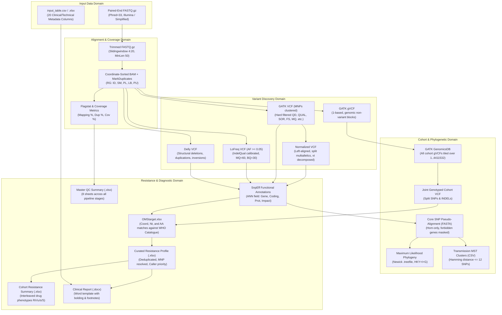

# Data Flow & Transformation Models — BrSeqTB

**Document ID**: `DATA-001`  
**Repository**: `LaPAM-USP/BrSeqTB`  
**Date**: August 13, 2026  
**Pipeline Framework**: Nextflow DSL2  

---

## 1. Overview of Data Lifecycles

BrSeqTB transforms raw paired-end short-read sequencing data into standardized genomic variants, phylogenetic networks, and medical diagnostic reports. Information travels through five distinct operational domains:

```
[Raw Sequencing Data (FASTQ)]
       │
       ▼
[Aligned Reads & Alignments (BAM / BAI)]
       │
       ▼
[Raw & Filtered Variants (VCF / gVCF / BCF)]
       │
       ▼
[Annotated & Matched Variants (ANN XLSX / TSV)]
       │
       ▼
[Consensus Aggregations & Clinical Reports (FASTA / XLSX / DOCX)]
```

---

## 2. End-to-End Data Transformation Map



---

## 3. Data Transformations by Entity

### 3.1 Sample Manifest & FASTQ Pairs
- **Input Format**: UTF-8/Latin1/CP1252 CSV or Excel (`input/input_table.csv` or `.xlsx`).
- **Identifier**: `Biosample` column value (must match FASTQ filename prefix).
- **Naming Conventions Supported**:
  1. Illumina Standard: `<BIOSAMPLE>_S<NUM>_L<LANE>_R<1|2>_001.fastq.gz`
  2. Simplified: `<BIOSAMPLE>_<1|2>.fastq.gz` (mapped to synthetic `S1_L001` internally).
- **Transformation**: Validated by `bin/make_manifest_validate.py` to ensure complete, non-empty pairs with even file counts.
- **Output Format**: Single-column TSV `manifest.tsv`.

---

### 3.2 Read Alignments & Read Groups (BAM)
- **Input**: Quality-trimmed paired FASTQ files.
- **Coordinate System**: 1-based, reference H37Rv (`NC_000962.3`, 4,411,532 bp).
- **Read Group Headers (`@RG`)**:
  - `ID`: `<BIOSAMPLE>_S<NUM>_L<LANE>`
  - `SM`: `<BIOSAMPLE>`
  - `PL`: `ILLUMINA`
  - `LB`: `<BIOSAMPLE>`
  - `PU`: `S<NUM>_L<LANE>`
- **Multi-Lane Merging**: When multiple sequencing lanes exist per biosample, individual BAMs are created and merged via `samtools merge` before sorting.
- **Duplicate Marking**: Performed by Picard `MarkDuplicates` with `VALIDATION_STRINGENCY=LENIENT`.
- **Quality Filters**: Primary mapped percentage $\ge 95\%$, reference breadth of coverage $\ge 90\%$.

---

### 3.3 Variant Representations (VCFs across Callers)

| Caller | Output File | Coordinate System | Representation Nuances |
| :--- | :--- | :--- | :--- |
| **GATK (VCF Mode)** | `gatk/<sample>_gatk.vcf.gz` | 1-based | MNPs clustered within 1 bp (`--max-mnp-distance 1`). Formats: `GT:AD:DP:GQ:PL`. |
| **GATK (GVCF Mode)**| `gatk/<sample>.g.vcf.gz` | 1-based | Non-variant regions represented as `END=<pos>` reference blocks. |
| **LoFreq** | `lofreq/<sample>_lofreq.vcf.gz` | 1-based | Somatic/subclonal calls. DP4 strand depth info. Formats: `INFO/AF`, `INFO/DP`, `INFO/DP4`. |
| **Delly** | `delly/<sample>_delly.vcf.gz` | 1-based | Structural variant endpoints (`CHR2`, `POS`, `INFO/END`, `INFO/SVTYPE`). |
| **Normalized** | `norm/<sample>_norm.vcf.gz` | 1-based | Multiallelic sites split; block substitutions decomposed into atomic SNPs/INDELs. |

---

### 3.4 SnpEff Functional Annotations
- **Input**: VCFs from all 4 callers.
- **Annotation Format**: Standard SnpEff `ANN` field added to `INFO`:
  ```text
  ANN=ALT|Annotation|Impact|Gene_Name|Gene_ID|Feature_Type|Feature_ID|Transcript_BioType|Rank|HGVS.c|HGVS.p|...
  ```
- **Custom Identifier Resolution**: SnpEff builds annotations using custom database `NC_0009623` (`database/snpeff/snpEff.config`).

---

### 3.5 WHO AMR Target Matching Table (`OMStarget.xlsx`)
- **Matching Methodology**: Variants from all callers are compared against `database/omsCatalog/tbdr_genomic_coordinates.csv` and `tbdr_catalogue_master_file.csv` using three parallel matching strategies:
  1. **Coordinate Match**: Exact tuple match on `(position, ref, alt)`.
  2. **Nucleotide Change Match**: Exact string match on `nt_change` (e.g. `rpoB_c.-15C>T`).
  3. **Amino Acid Change Match**: Exact string match on `aa_change` (e.g. `rpoB_p.Ser450Leu`).
- **Hierarchy Handling**: All three matching outputs are concatenated into a union table; duplicates are preserved at this stage.

---

### 3.6 Curated AMR Report (`results/resistance/<sample>.xlsx`)
- **Input**: `<sample>_OMStarget.xlsx`.
- **Complex Variant Resolution**:
  - If a Multinucleotide Polymorphism (MNP, e.g. `ATC -> GGG`) is present, atomic decomposed SNPs within that span are removed.
  - If an overlapping deletion is homozygous (`HOM`), overlapping single-nucleotide variants are purged.
  - Insertions do not invalidate overlapping SNPs.
- **Caller Priority Selection**:
  ```text
  GATK > NORM > LOFREQ > DELLY
  ```
- **Evidence Code Mapping**:
  - `Assoc w R` $\to$ `R`
  - `Assoc w R - Interim` $\to$ `r`
  - `Uncertain significance` $\to$ `u`
  - `Not assoc w R - Interim` $\to$ `s`
  - `Not assoc w R` $\to$ `S`
- **Output Schema**: `drug`, `gene`, `tier`, `variant`, `effect`, `evidence`, `comment`, `af`, `alt_reads`, `heteroresistance`, `filter_status`, `filter_method`, `caller`.

---

### 3.7 Cohort Matrices & Phylogenetic Data
- **Forbidden Genes Masking**: Variants in 488 repetitive/mobile element genes (`forbidden_genes.txt`) are excluded from downstream alignments.
- **Pseudo-Alignment SNP Matrix (`snpmatrix.fasta`)**:
  - Reference sequence (`NC0009623.fasta`) is modified by injecting sample homozygous SNPs.
  - Variable positions across all cohort members are extracted into concatenated FASTA alignments.
  - Heterozygous positions are excluded.
- **Hamming Distance Matrix (`snp_matrix.tsv`)**: Pairwise SNP mismatch count between all sample FASTA records.
- **Phylogenetic Tree (`snpmatrix.treefile`)**: Maximum Likelihood Newick tree produced by IQ-TREE 2 under `HKY+I+G` with 1000 ultrafast bootstrap replicates.
- **Transmission Network (`transmission_clusters.csv`)**: Minimum Spanning Tree (MST) constructed on the pairwise distance matrix and pruned at $\le 12$ SNPs. Connected components define transmission cluster identifiers (`cluster_id`).

---

### 3.8 Mixed Infection Table & Summary
- **Input**: `mixInfection/<sample>/<sample>.tsv` (contains all core SNPs including heterozygous sites).
- **Masking**: All SNPs located inside `database/omsCatalog/tbdr.bed` (0-based start, 1-based end) are masked to prevent drug-selected resistance variants from falsely inflating mixed-infection metrics.
- **Metric**: Proportion of heterozygous SNPs ($\text{het\_snps} / \text{total\_unmasked\_snps}$).
- **Classification**: $\ge 0.35 \to \text{MIXED}$, $< 0.35 \to \text{NOT MIXED}$.

---

### 3.9 Clinical Medical Report (`results/clinicalReport/<sample>.docx`)
- **Template**: Microsoft Word template (`assets/templates/report_template.docx`).
- **Data Ingestion**: Merges sample metadata from `input_table.csv` with lineage from `qc_summary.xlsx` and curated AMR variants from `results/resistance/<sample>.xlsx`.
- **Special Formatting**:
  - Borderline mutations flagged with dagger symbol (`†`).
  - Heteroresistance flagged with superscript h (`ʰ`) along with AF and alt read counts.
  - Footnote superscripts mapped to translated catalogue comments.
  - If sample is pan-susceptible, the resistant drugs table row is removed.
