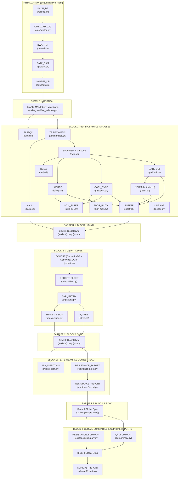

# Pipeline Architecture — BrSeqTB

**Document ID**: `PIPE-001`  
**Repository**: `LaPAM-USP/BrSeqTB`  
**Date**: August 13, 2026  
**Pipeline Framework**: Nextflow DSL2 (`main.nf`)  

---

## 1. Overview & Execution Architecture

BrSeqTB is structured as a staged workflow DAG executed through Nextflow DSL2. It contains 30 distinct processes organized into four primary execution blocks with sequential initialization and explicit channel synchronization barriers.

---

## 2. Stage-by-Stage Detailed Specification

### Stage 0.1: KAIJU_DB
- **Purpose**: Download and verify the Kaiju custom *Mycobacterium* reference database from Zenodo, or verify a manual local copy.
- **Input**: Parameter `params.addKaijuManually`.
- **Processing**: Executes `bin/kaijudb.sh`. Downloads `db.tar.gz` from Zenodo (`records/18064127`), checks SHA256 (`74b05e77a5b43a4d0e6c81cc1dfe826596458889fec3b874ecd2a27a0a36eab6`), and extracts `nodes.dmp`, `names.dmp`, and `*.fmi`.
- **Output**: `database/kaiju/db/` directory containing uncompressed taxonomy and index files; emission of boolean token `true`.
- **Dependencies**: `wget`/`curl`, `tar`, `sha256sum`, `awk`.
- **Parameters**: `params.addKaijuManually` (`false` by default).
- **Failure Modes**: Network timeout downloading 30+ MB archive; SHA256 checksum mismatch; disk full.
- **Evidence in Repository**: [main.nf:25-40](file:///home/falat/Repositories/BrSeqTB/main.nf#L25-L40), [bin/kaijudb.sh:1-164](file:///home/falat/Repositories/BrSeqTB/bin/kaijudb.sh#L1-L164).
- **Unknowns**: None.

---

### Stage 0.2: OMS_CATALOG
- **Purpose**: Extract genomic intervals, drug resistance associations, and coordinate mapping tables from the official WHO 2023 2nd Edition Excel catalogue.
- **Input**: `database/omsCatalog/WHO-UCN-TB-2023.7-eng.xlsx`.
- **Processing**: Executes `bin/omsCatalog.py`. Parses sheets `Genomic_coordinates` and `Catalogue_master_file`. Builds non-redundant intervals (`tbdr.bed`), extracts resistance positions (`tbdrR.csv`), and saves normalized CSV tables.
- **Output**: `database/omsCatalog/tbdr.bed`, `tbdrR.csv`, `tbdr_catalogue_master_file.csv`, `tbdr_genomic_coordinates.csv`.
- **Dependencies**: Python 3.10, `pandas`, `numpy`, `openpyxl`.
- **Parameters**: None.
- **Failure Modes**: Missing Excel file; modified sheet names; non-numeric coordinates in catalogue.
- **Evidence in Repository**: [main.nf:43-58](file:///home/falat/Repositories/BrSeqTB/main.nf#L43-L58), [bin/omsCatalog.py:1-261](file:///home/falat/Repositories/BrSeqTB/bin/omsCatalog.py#L1-L261).
- **Unknowns**: None.

---

### Stage 0.3: BWA_REF
- **Purpose**: Verify presence of reference genome and generate complete 5-file BWA index (`.bwt`, `.pac`, `.ann`, `.amb`, `.sa`).
- **Input**: `database/mtbRef/NC0009623.fasta`.
- **Processing**: Executes `bin/bwaref.sh`. Verifies existing index files; runs `bwa index` if missing.
- **Output**: `database/mtbRef/NC0009623.fasta.{bwt,pac,ann,amb,sa}`.
- **Dependencies**: `bwa=0.7.17`.
- **Parameters**: None.
- **Failure Modes**: Missing reference FASTA; partial index present causing script abort.
- **Evidence in Repository**: [main.nf:61-76](file:///home/falat/Repositories/BrSeqTB/main.nf#L61-L76), [bin/bwaref.sh:1-75](file:///home/falat/Repositories/BrSeqTB/bin/bwaref.sh#L1-L75).
- **Unknowns**: None.

---

### Stage 0.4: GATK_DICT
- **Purpose**: Generate samtools FASTA index (`.fai`) and GATK sequence dictionary (`.dict`) for H37Rv.
- **Input**: `database/mtbRef/NC0009623.fasta`.
- **Processing**: Executes `bin/gatkdict.sh`. Runs `samtools faidx` and `gatk CreateSequenceDictionary`.
- **Output**: `database/mtbRef/NC0009623.fasta.fai`, `database/mtbRef/NC0009623.dict`.
- **Dependencies**: `gatk4`, `samtools=1.18`.
- **Parameters**: None.
- **Failure Modes**: Java runtime error; malformed FASTA headers.
- **Evidence in Repository**: [main.nf:79-94](file:///home/falat/Repositories/BrSeqTB/main.nf#L79-L94), [bin/gatkdict.sh:1-58](file:///home/falat/Repositories/BrSeqTB/bin/gatkdict.sh#L1-L58).
- **Unknowns**: None.

---

### Stage 0.5: SNPEFF_DB
- **Purpose**: Construct custom SnpEff database `NC_0009623` from GFF3 annotations and FASTA sequence without CDS validation.
- **Input**: `database/mtbRef/genes.gff`, `database/mtbRef/sequences.fa`.
- **Processing**: Executes `bin/snpeffdb.sh`. Configures local `database/snpeff/snpEff.config` and runs `snpEff build -gff3 -noCheckCds -noCheckProtein -v NC_0009623`.
- **Output**: `database/snpeff/data/NC_0009623/snpEffectPredictor.bin`.
- **Dependencies**: `snpeff=5.2`, `openjdk=17`.
- **Parameters**: None.
- **Failure Modes**: Inconsistent GFF3 features; missing `snpEff.config` template in Conda package.
- **Evidence in Repository**: [main.nf:97-112](file:///home/falat/Repositories/BrSeqTB/main.nf#L97-L112), [bin/snpeffdb.sh:1-123](file:///home/falat/Repositories/BrSeqTB/bin/snpeffdb.sh#L1-L123).
- **Unknowns**: None.

---

### Stage 1: MAKE_MANIFEST_VALIDATE
- **Purpose**: Parse sample sheet (`.csv` or `.xlsx`), validate presence and pairing of forward and reverse FASTQs, and output `manifest.tsv`.
- **Input**: `input/input_table.csv` (or `.xlsx`), `reads/` directory.
- **Processing**: Executes `bin/make_manifest_validate.py`. Performs regex matching according to `--naming illumina` or `--naming simplified`. Verifies R1/R2 pairing.
- **Output**: `manifest.tsv` containing validated `biosample` IDs.
- **Dependencies**: Python 3.10, `openpyxl` (if xlsx used).
- **Parameters**: `params.inputTable`, `params.readsDir`, `params.readsNaming`.
- **Failure Modes**: Mismatched sample names; missing R1 or R2; non-even FASTQ count; invalid delimiter.
- **Evidence in Repository**: [main.nf:115-138](file:///home/falat/Repositories/BrSeqTB/main.nf#L115-L138), [bin/make_manifest_validate.py:1-321](file:///home/falat/Repositories/BrSeqTB/bin/make_manifest_validate.py#L1-L321).
- **Unknowns**: None.

---

### Stage 2.1: FASTQC
- **Purpose**: Quality check raw sequencing reads and calculate GC content and base quality metrics.
- **Input**: `reads/<sample>_S*_L*_R*_001.fastq.gz`.
- **Processing**: Executes `bin/fastqc.sh`. Runs `fastqc`, unzips reports, parses `fastqc_data.txt`, and calculates mean per-base quality and GC percentages.
- **Output**: `fastqc/<sample>/<sample>_fastqc_summary.csv`, HTML/ZIP reports.
- **Dependencies**: `fastqc`, `unzip`, `awk`, `bc`.
- **Parameters**: Hardcoded thresholds (`MIN_QUALITY=20`, GC bounds `62%-68%`).
- **Failure Modes**: Corrupted FASTQ files; empty files.
- **Evidence in Repository**: [main.nf:147-161](file:///home/falat/Repositories/BrSeqTB/main.nf#L147-L161), [bin/fastqc.sh:1-145](file:///home/falat/Repositories/BrSeqTB/bin/fastqc.sh#L1-L145).
- **Unknowns**: None.

---

### Stage 2.2: TRIMMOMATIC
- **Purpose**: Perform sliding window quality trimming and minimum length filtering on paired-end reads.
- **Input**: `reads/<sample>_S*_L*_R1_001.fastq.gz` and `..._R2_001.fastq.gz`.
- **Processing**: Executes `bin/trimmomatic.sh`. Runs `trimmomatic PE ... SLIDINGWINDOW:4:20 MINLEN:50`. Drops unpaired reads and calculates surviving read pair statistics.
- **Output**: `trimmomatic/<sample>/<sample>_S*_L*_R{1,2}_001.fastq.gz`, `trimmomatic/<sample>/<sample>_trimmomatic_summary.csv`.
- **Dependencies**: `trimmomatic=0.39`, `openjdk=17`.
- **Parameters**: `SLIDINGWINDOW:4:20`, `MINLEN:50`, `MIN_BOTH_SURVIVING=75.0%`.
- **Failure Modes**: Adapter contamination remaining (no adapter clipping specified in command); surviving pairs < 75% flagging `FAIL`.
- **Evidence in Repository**: [main.nf:164-179](file:///home/falat/Repositories/BrSeqTB/main.nf#L164-L179), [bin/trimmomatic.sh:1-139](file:///home/falat/Repositories/BrSeqTB/bin/trimmomatic.sh#L1-L139).
- **Unknowns**: Why adapter sequences (`ILLUMINACLIP`) are omitted from Trimmomatic arguments.

---

### Stage 2.3: KAIJU
- **Purpose**: Perform taxonomic classification of trimmed reads to screen for non-MTB or NTM contamination.
- **Input**: Trimmed FASTQs in `trimmomatic/<sample>/`.
- **Processing**: Executes `bin/kaiju.sh`. Runs `kaiju -t nodes.dmp -f *.fmi -i R1 -j R2`, exports Krona text (`kaiju2krona`), HTML report (`ktImportText`), and summary table (`kaiju2table`).
- **Output**: `kaiju/<sample>/<sample>_kaiju.out`, `kaiju/<sample>/<sample>_kaiju_report.html`, `kaiju/<sample>/<sample>_kaiju_summary.csv`.
- **Dependencies**: `kaiju=1.9.x`, `krona=2.8.x`.
- **Parameters**: Multithreading via `NXF_TASK_CPUS`.
- **Failure Modes**: Missing `.fmi` index; only reads the first lane if multi-lane sequencing was performed (`head -n 1`).
- **Evidence in Repository**: [main.nf:182-197](file:///home/falat/Repositories/BrSeqTB/main.nf#L182-L197), [bin/kaiju.sh:1-111](file:///home/falat/Repositories/BrSeqTB/bin/kaiju.sh#L1-L111).
- **Unknowns**: None.

---

### Stage 2.4: BWA
- **Purpose**: Align trimmed reads to H37Rv, inject read group headers, merge multiple lanes, sort BAM, mark duplicates, and extract mapping/coverage metrics.
- **Input**: Trimmed FASTQs in `trimmomatic/<sample>/`.
- **Processing**: Executes `bin/bwa.sh`. For each pair, runs `bwa mem` with formatted `-R` read group tag (`ID`, `SM`, `PL:ILLUMINA`, `LB`, `PU`), merges multiple lane BAMs via `samtools merge`, sorts with `samtools sort`, marks duplicates with `picard MarkDuplicates (VALIDATION_STRINGENCY=LENIENT)`, and extracts flagstat/coverage stats.
- **Output**: `bwa/<sample>/<sample>.bam`, `<sample>.bam.bai`, `bwa/<sample>/<sample>_bwa_summary.csv`.
- **Dependencies**: `bwa=0.7.17`, `samtools=1.18`, `picard=3.x`, `openjdk=17`.
- **Parameters**: `MIN_MAPPED=95%`, `MIN_COVERAGE=90%`.
- **Failure Modes**: Non-Illumina naming breaking read group parsing; low mapped read percentage (<95%) or low genome coverage (<90%) resulting in `FAIL` status.
- **Evidence in Repository**: [main.nf:200-215](file:///home/falat/Repositories/BrSeqTB/main.nf#L200-L215), [bin/bwa.sh:1-189](file:///home/falat/Repositories/BrSeqTB/bin/bwa.sh#L1-L189).
- **Unknowns**: None.

---

### Stage 2.5: DELLY
- **Purpose**: Detect structural genomic variants (deletions, duplications, inversions, insertions, translocations).
- **Input**: `bwa/<sample>/<sample>.bam`.
- **Processing**: Executes `bin/delly.sh`. Runs `delly call -g NC0009623.fasta`, converts BCF to VCF with `bcftools view`, compresses with `bgzip`, and indexes with `tabix`.
- **Output**: `delly/<sample>/<sample>_delly.vcf.gz`, `delly/<sample>/<sample>_delly.vcf.gz.tbi`.
- **Dependencies**: `delly=1.x`, `bcftools=1.18`, `htslib=1.18`.
- **Parameters**: Default Delly parameters.
- **Failure Modes**: Malformed BAM; missing BAM index.
- **Evidence in Repository**: [main.nf:218-233](file:///home/falat/Repositories/BrSeqTB/main.nf#L218-L233), [bin/delly.sh:1-74](file:///home/falat/Repositories/BrSeqTB/bin/delly.sh#L1-L74).
- **Unknowns**: None.

---

### Stage 2.6: LOFREQ
- **Purpose**: Detect low-frequency and subclonal single-nucleotide variants and INDELs.
- **Input**: `bwa/<sample>/<sample>.bam`.
- **Processing**: Executes `bin/lofreq.sh`. Recalibrates indel qualities (`lofreq indelqual --dindel`), runs parallel variant calling (`lofreq call-parallel --pp-threads N --call-indels -m 60 -Q 30`), filters by minimum allele frequency (`lofreq filter -a ${MIN_AF}`), and compresses with `bgzip`.
- **Output**: `lofreq/<sample>/<sample>_lofreq.vcf.gz`, `..._lofreq.vcf.gz.csi`.
- **Dependencies**: `lofreq=2.1.x`, `samtools=1.18`, `bcftools=1.18`, `htslib=1.18`.
- **Parameters**: `params.lofreqMinAf` (default: `0.05`), `MQ=60`, `BQ=30`.
- **Failure Modes**: Low coverage resulting in 0 variants; missing BAM index.
- **Evidence in Repository**: [main.nf:236-252](file:///home/falat/Repositories/BrSeqTB/main.nf#L236-L252), [bin/lofreq.sh:1-148](file:///home/falat/Repositories/BrSeqTB/bin/lofreq.sh#L1-L148).
- **Unknowns**: None.

---

### Stage 2.7: GATK_GVCF
- **Purpose**: Generate genomic VCF (gVCF) records per biosample containing non-variant confidence blocks for cohort genotyping.
- **Input**: `bwa/<sample>/<sample>.bam`.
- **Processing**: Executes `bin/gatkGvcf.sh`. Runs `gatk HaplotypeCaller -ERC GVCF` with annotations (`FisherStrand`, `StrandOddsRatio`, `QualByDepth`, `MappingQualityRankSumTest`, `ReadPosRankSumTest`, `DepthPerAlleleBySample`, `Coverage`).
- **Output**: `gatk/<sample>/<sample>.g.vcf.gz`, `...g.vcf.gz.tbi`.
- **Dependencies**: `gatk4`, `samtools=1.18`, `openjdk=17`.
- **Parameters**: `--native-pair-hmm-threads`.
- **Failure Modes**: Out-of-memory errors on large BAMs; missing sequence dictionary.
- **Evidence in Repository**: [main.nf:255-269](file:///home/falat/Repositories/BrSeqTB/main.nf#L255-L269), [bin/gatkGvcf.sh:1-100](file:///home/falat/Repositories/BrSeqTB/bin/gatkGvcf.sh#L1-L100).
- **Unknowns**: None.

---

### Stage 2.8: GATK_VCF
- **Purpose**: Call single-sample variants with multinucleotide polymorphism (MNP) clustering and apply hard quality filters.
- **Input**: `bwa/<sample>/<sample>.bam`.
- **Processing**: Executes `bin/gatkVcf.sh`. Runs `gatk HaplotypeCaller --max-mnp-distance 1` to produce raw VCF, followed by `gatk VariantFiltration` (applying `QD < 2.0`, `QUAL < 30.0`, `SOR > 3.0`, `FS > 60.0`, `MQ < 40.0`, `MQRankSum < -12.5`, `ReadPosRankSum < -8.0` for SNPs; `QUAL < 30.0`, `FS > 200.0`, `ReadPosRankSum < -20.0` for INDELs).
- **Output**: `gatk/<sample>/<sample>_gatk.vcf.gz`, `..._gatk.vcf.gz.tbi`.
- **Dependencies**: `gatk4`, `samtools=1.18`, `openjdk=17`.
- **Parameters**: Hardcoded filter expressions.
- **Failure Modes**: Malformed filter expressions; Java heap exhaustion.
- **Evidence in Repository**: [main.nf:272-288](file:///home/falat/Repositories/BrSeqTB/main.nf#L272-L288), [bin/gatkVcf.sh:1-132](file:///home/falat/Repositories/BrSeqTB/bin/gatkVcf.sh#L1-L132).
- **Unknowns**: None.

---

### Stage 2.9: NORM
- **Purpose**: Left-align INDELs, split multiallelic sites, and decompose complex MNPs/block substitutions into atomic primitives.
- **Input**: `gatk/<sample>/<sample>_gatk.vcf.gz`.
- **Processing**: Executes `bin/norm.sh`. Streams `bcftools norm --fasta-ref ... -m-any` into `vt decompose_blocksub`, compresses with `bgzip`, and indexes with `bcftools index`.
- **Output**: `norm/<sample>/<sample>_norm.vcf.gz`, `..._norm.vcf.gz.csi`.
- **Dependencies**: `bcftools=1.18`, `vt=2015.11.10`, `htslib=1.18`.
- **Parameters**: `-m-any` (split multiallelics).
- **Failure Modes**: Reference FASTA mismatch; unindexed input VCF.
- **Evidence in Repository**: [main.nf:290-305](file:///home/falat/Repositories/BrSeqTB/main.nf#L290-L305), [bin/norm.sh:1-100](file:///home/falat/Repositories/BrSeqTB/bin/norm.sh#L1-L100).
- **Unknowns**: None.

---

### Stage 2.10: TBDR_RCOV
- **Purpose**: Calculate sequencing read depth across all WHO drug-resistance candidate loci using gVCF depth intervals, flagging regions with $<10\times$ depth.
- **Input**: `database/omsCatalog/tbdrR.csv`, `gatk/<sample>/<sample>.g.vcf.gz`.
- **Processing**: Executes `bin/tbdrRCov.py`. Extracts non-variant depth intervals from gVCF using `pysam`, searches resistance positions, and records any locus with $\text{DP} < 10$.
- **Output**: `tbdrRCov/<sample>/<sample>_tbdrRcov_summary.csv`.
- **Dependencies**: Python 3.10, `pysam`, `pandas`, `numpy`.
- **Parameters**: Depth threshold `< 10`.
- **Failure Modes**: Missing `tbdrR.csv`; unindexed gVCF.
- **Evidence in Repository**: [main.nf:307-322](file:///home/falat/Repositories/BrSeqTB/main.nf#L307-L322), [bin/tbdrRCov.py:1-187](file:///home/falat/Repositories/BrSeqTB/bin/tbdrRCov.py#L1-L187).
- **Unknowns**: None.

---

### Stage 2.11: LINEAGE
- **Purpose**: Infer phylogenetic lineages and sublineages by matching normalized VCF variants against embedded canonical SNP markers.
- **Input**: `norm/<sample>/<sample>_norm.vcf.gz`.
- **Processing**: Executes `bin/lineage.py`. Looks up `(POS, ALT)` in embedded 5,700-entry `BrSeq_db` dictionary and appends `LINEAGE`, `LINEAGE_DETAILS`, and `COMMENT` columns.
- **Output**: `lineage/<sample>/<sample>_lineage_summary.csv`.
- **Dependencies**: Python 3.10, standard libraries (`gzip`, `csv`).
- **Parameters**: None.
- **Failure Modes**: Missing normalized VCF; non-numeric positions.
- **Evidence in Repository**: [main.nf:324-339](file:///home/falat/Repositories/BrSeqTB/main.nf#L324-L339), [bin/lineage.py:1-5760](file:///home/falat/Repositories/BrSeqTB/bin/lineage.py#L1-L5760).
- **Unknowns**: Provenance and maintenance protocol for embedded `BrSeq_db` dictionary.

---

### Stage 2.12: NTM_FILTER
- **Purpose**: Evaluate non-tuberculous mycobacterial contamination at diagnostic marker locus `NC_000962.3:1472307` across LoFreq and GATK gVCF data.
- **Input**: `lofreq/<sample>/<sample>_lofreq.vcf.gz`, `gatk/<sample>/<sample>.g.vcf.gz`.
- **Processing**: Executes `bin/ntmFilter.sh`. Checks LoFreq AF at position 1472307 ($\ge 0.20 \to \text{FAIL}$). If absent in LoFreq, extracts gVCF genotype block (`0/0` with $\text{DP} > 0 \to \text{PASS}$; `0/1` or `1/1` $\to \text{FAIL}$; no coverage $\to \text{NOCOV}$).
- **Output**: `ntmFilter/<sample>/<sample>_ntm_summary.csv`.
- **Dependencies**: `bcftools=1.18`, `bc`.
- **Parameters**: Position `1472307`, AF cutoff `0.20`.
- **Failure Modes**: Missing LoFreq or gVCF files.
- **Evidence in Repository**: [main.nf:341-356](file:///home/falat/Repositories/BrSeqTB/main.nf#L341-L356), [bin/ntmFilter.sh:1-151](file:///home/falat/Repositories/BrSeqTB/bin/ntmFilter.sh#L1-L151).
- **Unknowns**: Biological derivation of position 1472307 as sole NTM marker.

---

### Stage 2.13: SNPEFF
- **Purpose**: Annotate functional consequences (gene, coding change, amino acid change, effect) across all four caller VCFs.
- **Input**: VCFs from `gatk/`, `norm/`, `lofreq/`, `delly/`.
- **Processing**: Executes `bin/snpeff.sh`. Strictly requires all 4 callers to be present. Executes `snpEff eff -c snpEff.config -ud 100 NC_0009623` on each VCF, compresses with `bgzip`, and indexes with `tabix`.
- **Output**: `snpeff/<sample>/<sample>_{gatk,norm,lofreq,delly}.vcf.gz`.
- **Dependencies**: `snpeff=5.2`, `openjdk=17`, `htslib=1.18`.
- **Parameters**: Upstream/downstream window `-ud 100`.
- **Failure Modes**: Any of the 4 callers failing or missing aborts annotation.
- **Evidence in Repository**: [main.nf:358-373](file:///home/falat/Repositories/BrSeqTB/main.nf#L358-L373), [bin/snpeff.sh:1-147](file:///home/falat/Repositories/BrSeqTB/bin/snpeff.sh#L1-L147).
- **Unknowns**: None.

---

### Stage 3.1: COHORT
- **Purpose**: Combine all sample gVCFs into a GATK GenomicsDB, perform joint genotyping, and separate SNPs and INDELs with hard quality filters.
- **Input**: `manifest.tsv`, `gatk/<sample>/<sample>.g.vcf.gz` (plus optional `assets/auxCohort/gatk/` gVCFs).
- **Processing**: Executes `bin/cohort.sh`. Imports gVCFs over whole-genome interval (`variant_intervals.bed`: 1–4,411,532) with `gatk GenomicsDBImport`, runs `gatk GenotypeGVCFs`, splits SNPs/INDELs with `gatk SelectVariants`, and applies `gatk VariantFiltration`.
- **Output**: `cohort/cohort_snps_filtered.vcf.gz`, `cohort/cohort_indels_filtered.vcf.gz`.
- **Dependencies**: `gatk4`, `openjdk=17`.
- **Parameters**: `params.auxCohort`.
- **Failure Modes**: Disk exhaustion during GenomicsDB build; `FS200 > 200.0` syntax bug in INDEL filter line 202.
- **Evidence in Repository**: [main.nf:382-403](file:///home/falat/Repositories/BrSeqTB/main.nf#L382-L403), [bin/cohort.sh:1-216](file:///home/falat/Repositories/BrSeqTB/bin/cohort.sh#L1-L216).
- **Unknowns**: Whether `FS200 > 200.0` was intended as `FS > 200.0`.

---

### Stage 3.2: COHORT_FILTER
- **Purpose**: Compile filtered cohort SNPs and INDELs into a tabular Excel reference for downstream per-sample filtering.
- **Input**: `cohort/cohort_snps_filtered.vcf.gz`, `cohort/cohort_indels_filtered.vcf.gz`.
- **Processing**: Executes `bin/cohortFilter.py`. Reads VCF header and data records, concatenates SNPs and INDELs, and saves `filter.xlsx`.
- **Output**: `cohort/filter/filter.xlsx`.
- **Dependencies**: Python 3.10, `pandas`, `openpyxl`.
- **Parameters**: None.
- **Failure Modes**: Missing cohort VCF files.
- **Evidence in Repository**: [main.nf:405-420](file:///home/falat/Repositories/BrSeqTB/main.nf#L405-L420), [bin/cohortFilter.py:1-94](file:///home/falat/Repositories/BrSeqTB/bin/cohortFilter.py#L1-L94).
- **Unknowns**: None.

---

### Stage 3.3: SNP_MATRIX
- **Purpose**: Construct multi-sample pseudo-alignment FASTA matrix (excluding heterozygous calls and forbidden genes) and export per-sample SNP tables for mixed infection analysis.
- **Input**: `snpeff/<sample>/<sample>_norm.vcf.gz`, `database/mtbRef/forbidden_genes.txt`, `database/mtbRef/NC0009623.fasta`.
- **Processing**: Executes `bin/snpMatrix.py`. Filters out variants in 488 forbidden genes. Builds `mixInfection/<sample>/<sample>.tsv` (with heterozygous calls) and `snpMatrix/snpmatrix.fasta` (homozygous calls only).
- **Output**: `snpMatrix/snpmatrix.fasta`, `mixInfection/<sample>/<sample>.tsv`.
- **Dependencies**: Python 3.10, `pysam`, `biopython`.
- **Parameters**: Strict case-insensitive forbidden gene matching.
- **Failure Modes**: Missing SnpEff normalized VCFs; 0 SNPs in cohort causing exit.
- **Evidence in Repository**: [main.nf:422-437](file:///home/falat/Repositories/BrSeqTB/main.nf#L422-L437), [bin/snpMatrix.py:1-288](file:///home/falat/Repositories/BrSeqTB/bin/snpMatrix.py#L1-L288).
- **Unknowns**: None.

---

### Stage 3.4: TRANSMISSION
- **Purpose**: Compute pairwise SNP distance matrix and infer transmission clusters via Minimum Spanning Tree (MST).
- **Input**: `snpMatrix/snpmatrix.fasta`.
- **Processing**: Executes `bin/transmission.py`. Computes Hamming distance matrix, constructs NetworkX complete graph, extracts MST, prunes edges $> 12$ SNPs, and assigns connected components as `cluster_id`.
- **Output**: `transmission/transmission_clusters.csv`, `transmission/snp_distance_matrix.xlsx`, `results/transmission_clusters.csv`.
- **Dependencies**: Python 3.10, `networkx`, `pandas`, `biopython`, `openpyxl`.
- **Parameters**: `CUTOFF = 12` SNPs.
- **Failure Modes**: Missing FASTA; unequal sequence lengths.
- **Evidence in Repository**: [main.nf:439-454](file:///home/falat/Repositories/BrSeqTB/main.nf#L439-L454), [bin/transmission.py:1-130](file:///home/falat/Repositories/BrSeqTB/bin/transmission.py#L1-L130).
- **Unknowns**: Empirical validation of 12-SNP transmission threshold.

---

### Stage 3.5: IQTREE
- **Purpose**: Reconstruct Maximum Likelihood phylogenetic tree from core SNP pseudo-alignment.
- **Input**: `snpMatrix/snpmatrix.fasta`.
- **Processing**: Executes `bin/iqtree.sh`. Runs `iqtree -s snpmatrix.fasta -m HKY+I+G -B 1000 -T N -redo`.
- **Output**: `iqtree/snpmatrix.treefile`, `iqtree/iqtree_run.log`.
- **Dependencies**: `iqtree=2.x`.
- **Parameters**: `-m HKY+I+G`, `-B 1000`.
- **Failure Modes**: Alignment contains $<3$ taxa; constant sites leading to model fitting warnings.
- **Evidence in Repository**: [main.nf:456-471](file:///home/falat/Repositories/BrSeqTB/main.nf#L456-L471), [bin/iqtree.sh:1-71](file:///home/falat/Repositories/BrSeqTB/bin/iqtree.sh#L1-L71).
- **Unknowns**: None.

---

### Stage 4.1: MIX_INFECTION
- **Purpose**: Detect mixed clonal tuberculosis strain infections by evaluating genome-wide heterozygous SNP proportions outside masked resistance intervals.
- **Input**: `mixInfection/<sample>/<sample>.tsv`, `database/omsCatalog/tbdr.bed`.
- **Processing**: Executes `bin/mixInfection.py`. Masks positions within `tbdr.bed`. Calculates proportion of heterozygous SNPs ($\text{het} / \text{total}$). Classifies as `MIXED` if $\ge 0.35$, otherwise `NOT MIXED`.
- **Output**: `mixInfection/<sample>/<sample>_mixinfection_summary.csv`.
- **Dependencies**: Python 3.10, standard libraries (`csv`).
- **Parameters**: `MIX_THRESHOLD = 0.35`.
- **Failure Modes**: Missing TSV file; missing BED file.
- **Evidence in Repository**: [main.nf:480-495](file:///home/falat/Repositories/BrSeqTB/main.nf#L480-L495), [bin/mixInfection.py:1-169](file:///home/falat/Repositories/BrSeqTB/bin/mixInfection.py#L1-L169).
- **Unknowns**: Scientific justification for 35% heterozygous threshold.

---

### Stage 4.2: RESISTANCE_TARGET
- **Purpose**: Extract variant metrics and perform multi-tier matching against the WHO TB drug resistance catalogue across all callers.
- **Input**: Annotated VCFs in `snpeff/<sample>/`, `cohort/filter/filter.xlsx`, WHO catalogue CSVs.
- **Processing**: Executes `bin/resistanceTarget.py`. Extracts AF, depth, zygosity (`HOM` if $\text{AF} \ge 0.90$, else `HET`). Matches variants via 3 independent strategies: coordinate match (`pos-ref-alt`), nucleotide change match (`nt_change`), and amino acid change match (`aa_change`).
- **Output**: `resistance/<sample>/<sample>_{caller}_ANN.xlsx`, `resistance/<sample>/<sample>_OMStarget.xlsx`.
- **Dependencies**: Python 3.10, `pysam`, `pandas`, `openpyxl`.
- **Parameters**: Filter requirements (LoFreq $\ge 3$ alt reads, $\text{DP} \ge 10$; GATK cohort PASS or $\text{DP} \ge 10, \text{AF} \ge 0.05, \text{alt\_reads} \ge 3$).
- **Failure Modes**: Missing any of the 4 caller VCFs; missing `cohort/filter/filter.xlsx`.
- **Evidence in Repository**: [main.nf:498-513](file:///home/falat/Repositories/BrSeqTB/main.nf#L498-L513), [bin/resistanceTarget.py:1-685](file:///home/falat/Repositories/BrSeqTB/bin/resistanceTarget.py#L1-L685).
- **Unknowns**: None.

---

### Stage 4.3: RESISTANCE_REPORT
- **Purpose**: Curate, deduplicate, and resolve complex MNPs/INDELs/SNPs into a final per-sample AMR profile.
- **Input**: `resistance/<sample>/<sample>_OMStarget.xlsx`.
- **Processing**: Executes `bin/resistanceReport.py`. Resolves decomposed SNPs inside MNPs, applies caller priority (`gatk > norm > lofreq > delly`), translates WHO confidence grades to evidence codes (`R`, `r`, `u`, `s`, `S`), and saves final curated Excel report.
- **Output**: `results/resistance/<sample>.xlsx`.
- **Dependencies**: Python 3.10, `pandas`, `openpyxl`.
- **Parameters**: `CALLER_PRIORITY = ["gatk", "norm", "lofreq", "delly"]`.
- **Failure Modes**: Empty OMStarget table.
- **Evidence in Repository**: [main.nf:516-531](file:///home/falat/Repositories/BrSeqTB/main.nf#L516-L531), [bin/resistanceReport.py:1-312](file:///home/falat/Repositories/BrSeqTB/bin/resistanceReport.py#L1-L312).
- **Unknowns**: None.

---

### Stage 5.1: RESISTANCE_SUMMARY
- **Purpose**: Aggregate per-sample PASS resistance profiles into a multi-drug cohort summary Excel matrix.
- **Input**: All `results/resistance/<sample>.xlsx` files.
- **Processing**: Executes `bin/resistanceSummary.py`. Summarizes drug phenotypes using flag hierarchy (`flagR` > `flagr` > `flagu` > `flagnR` > `flagnr`), interleaves drug phenotype and annotation columns, and defaults unmutated drugs to `S`.
- **Output**: `results/resistance_summary.xlsx`.
- **Dependencies**: Python 3.10, `pandas`, `openpyxl`.
- **Parameters**: None.
- **Failure Modes**: Missing `results/resistance/` directory.
- **Evidence in Repository**: [main.nf:540-555](file:///home/falat/Repositories/BrSeqTB/main.nf#L540-L555), [bin/resistanceSummary.py:1-189](file:///home/falat/Repositories/BrSeqTB/bin/resistanceSummary.py#L1-L189).
- **Unknowns**: None.

---

### Stage 5.2: QC_SUMMARY
- **Purpose**: Aggregate metrics from FastQC, Trimmomatic, BWA, NTM screening, MixInfection, Kaiju, Lineage, and TBDR coverage into a multi-sheet Excel workbook.
- **Input**: Summary CSVs from `fastqc/`, `trimmomatic/`, `bwa/`, `ntmFilter/`, `mixInfection/`, `kaiju/`, `lineage/`, and `tbdrRCov/`.
- **Processing**: Executes `bin/qcSummary.py`. Concatenates data into separate Excel sheets (`fastqc`, `trimmomatic`, `bwa`, `ntmFilter`, `mixInfection`, `kaiju`, `lineage`, `tbdrRCov`) using `xlsxwriter`.
- **Output**: `results/qc_summary.xlsx`.
- **Dependencies**: Python 3.10, `pandas`, `xlsxwriter`.
- **Parameters**: None.
- **Failure Modes**: Missing summary files resulting in empty sheets.
- **Evidence in Repository**: [main.nf:557-572](file:///home/falat/Repositories/BrSeqTB/main.nf#L557-L572), [bin/qcSummary.py:1-235](file:///home/falat/Repositories/BrSeqTB/bin/qcSummary.py#L1-L235).
- **Unknowns**: None.

---

### Stage 5.3: CLINICAL_REPORT
- **Purpose**: Generate individual patient-facing clinical diagnostic reports in Microsoft Word (`.docx`) format.
- **Input**: `input/input_table.csv`, `results/qc_summary.xlsx`, `results/resistance/<sample>.xlsx`, `assets/templates/report_template.docx`.
- **Processing**: Executes `bin/clinicalReport.py`. Populates Word placeholders (`PACIENTE`, `FARMACOS_R`, `VAR_RESISTENCIA`, `HETERORESISTENCIA`, `LINHAGEM`, `OBSERVACOES`, etc.), flags borderline mutations (`†`) and heteroresistance (`ʰ`), attempts Portuguese comment translation via `dictionary.xlsx` (fails silently if missing), and removes the resistant drugs table row if pan-susceptible.
- **Output**: `results/clinicalReport/<sample>.docx`.
- **Dependencies**: Python 3.10, `python-docx`, `pandas`, `openpyxl`.
- **Parameters**: `params.inputTable`.
- **Failure Modes**: Missing `report_template.docx`; missing sample row in sample sheet; missing `results/resistance/<sample>.xlsx`.
- **Evidence in Repository**: [main.nf:574-590](file:///home/falat/Repositories/BrSeqTB/main.nf#L574-L590), [bin/clinicalReport.py:1-428](file:///home/falat/Repositories/BrSeqTB/bin/clinicalReport.py#L1-L428).
- **Unknowns**: Missing `database/omsCatalog/dictionary.xlsx` causing comment translation to be skipped.
