# Repository Map — BrSeqTB

**Document ID**: `MAP-001`  
**Repository**: `LaPAM-USP/BrSeqTB`  
**Date**: August 13, 2026  
**Pipeline Framework**: Nextflow DSL2  
**Target Organism**: *Mycobacterium tuberculosis* (H37Rv / `NC_000962.3`)  

---

## 1. Repository Purpose

**BrSeqTB** is a specialized, end-to-end bioinformatics pipeline written in Nextflow DSL2, Python, and Bash. It processes Illumina paired-end whole-genome sequencing (WGS) data of *Mycobacterium tuberculosis* (MTB) isolates to perform:
- Raw read quality control and trimming.
- Taxonomic contamination screening against mycobacterial databases.
- Reference alignment, read group assignment, and duplicate marking.
- Multi-caller variant detection:
  - GATK HaplotypeCaller (in both VCF mode with MNP support and GVCF mode).
  - LoFreq (low-frequency somatic/subclonal variant calling with indel quality calibration).
  - Delly (structural variant discovery: DEL, DUP, INV, INS, BND).
- Variant normalization and block substitution decomposition (`bcftools norm` + `vt decompose_blocksub`).
- Comprehensive functional annotation using custom SnpEff databases (`NC_0009623`).
- In-depth antimicrobial resistance (AMR) profiling based on the World Health Organization (WHO) 2023 TB drug resistance catalogue.
- High-resolution lineage and sublineage typing using an embedded database of canonical SNP markers.
- Mixed infection inference by evaluating genome-wide heterozygous variant proportions outside masked resistance loci.
- Non-Tuberculous Mycobacteria (NTM) contamination filtering at position `NC_000962.3:1472307`.
- Multi-sample cohort aggregation via GATK GenomicsDB and hard filtering.
- Multiple-sample SNP pseudo-alignment matrix generation.
- Phylogenetic inference via IQ-TREE 2 (Maximum Likelihood under `HKY+I+G` with 1000 ultrafast bootstraps).
- Transmission cluster detection using Minimum Spanning Tree (MST) graphs thresholded at $\le 12$ SNPs.
- Automated generation of patient-ready Microsoft Word (`.docx`) clinical reports.

---

## 2. High-Level Directory Tree

```
BrSeqTB/
├── .gitignore                      # Git exclusion rules for intermediate folders, databases, and caches
├── AGENTS.md                       # Project agent collaboration guidelines
├── README.md                       # User-facing documentation and CLI execution guide
├── assets/                         # Static assets and precomputed resources
│   ├── auxCohort/                  # Precomputed reference panel for cohort augmentation
│   │   └── gatk/                   # 9 reference isolates (SRR34768817 .. SRR34768879) gVCFs & VCFs
│   └── templates/                  # Document templates
│       └── report_template.docx    # Microsoft Word template for clinical report generation
├── bin/                            # Pipeline executable scripts (13 Python, 17 Bash, 1 wrapper)
│   ├── brseqtb                     # Main CLI bash wrapper forwarding arguments to Nextflow
│   ├── bwa.sh                      # BWA-MEM alignment, RG tagging, samtools sort, Picard MarkDuplicates
│   ├── bwaref.sh                   # Reference FASTA index verification & BWA indexing
│   ├── clinicalReport.py           # DOCX clinical report assembler using python-docx
│   ├── cohort.sh                   # GATK GenomicsDBImport + GenotypeGVCFs cohort calling & hard filters
│   ├── cohortFilter.py             # Excel generator aggregating cohort filtered SNPs & INDELs
│   ├── delly.sh                    # Delly structural variant discovery
│   ├── fastqc.sh                   # FastQC raw read analysis & summary metric parser
│   ├── gatkGvcf.sh                 # GATK HaplotypeCaller in GVCF mode with HMM multithreading
│   ├── gatkVcf.sh                  # GATK HaplotypeCaller in VCF mode with MNP support & VariantFiltration
│   ├── gatkdict.sh                 # FASTA index (.fai) & GATK Sequence Dictionary (.dict) generator
│   ├── iqtree.sh                   # IQ-TREE 2 ML phylogenetic inference
│   ├── kaiju.sh                    # Kaiju taxonomic classification & Krona HTML generation
│   ├── kaijudb.sh                  # Kaiju custom database downloader & integrity verifier
│   ├── lineage.py                  # Lineage typing against embedded BrSeq_db SNP dictionary
│   ├── lofreq.sh                   # LoFreq indelqual + call-parallel + AF filter
│   ├── make_manifest_validate.py   # Manifest generator & strict FASTQ pairing validator
│   ├── mixInfection.py             # Mixed infection detection with tbdr.bed region masking
│   ├── norm.sh                     # bcftools norm + vt decompose_blocksub
│   ├── ntmFilter.sh                # NTM screening at locus NC_000962.3:1472307
│   ├── omsCatalog.py               # WHO 2023 Excel catalogue extractor (BED + CSVs)
│   ├── qcSummary.py                # Multi-tool cohort QC Excel report aggregator
│   ├── resistanceReport.py         # Per-sample curated AMR report generator & MNP resolver
│   ├── resistanceSummary.py        # Cohort multi-drug resistance summary Excel compiler
│   ├── resistanceTarget.py         # Multi-caller variant intersection against WHO catalogue
│   ├── snpMatrix.py                # SNP pseudo-alignment FASTA & mixInfection TSV generator
│   ├── snpeff.sh                   # Multi-caller SnpEff functional annotation
│   ├── snpeffdb.sh                 # Custom SnpEff database builder (NC_0009623)
│   ├── tbdrRCov.py                 # pysam-based sequencing depth checker across AMR loci (<10x)
│   ├── transmission.py             # Pairwise SNP distance matrix & MST transmission clustering
│   └── trimmomatic.sh              # Trimmomatic paired-end adapter/quality trimming
├── database/                       # Biological reference sequences, annotations, and databases
│   ├── kaiju/                      # Kaiju taxonomic database storage
│   │   └── db/                     # nodes.dmp, names.dmp, and FM-index (.fmi)
│   ├── mtbRef/                     # M. tuberculosis H37Rv reference data
│   │   ├── NC0009623.fasta         # Complete H37Rv genomic sequence (4,411,532 bp)
│   │   ├── forbidden_genes.txt     # List of 488 repetitive / mobile genes excluded from matrix
│   │   ├── genes.gff               # Gene annotation features in GFF3 format
│   │   └── sequences.fa            # Identical duplicate FASTA for SnpEff DB building
│   └── omsCatalog/                 # WHO AMR Catalogue files
│       ├── WHO-UCN-TB-2023.7-eng.xlsx # Official WHO 2nd Edition TB Drug Resistance Catalogue (30.9 MB)
│       ├── tbdr.bed                # Derived non-redundant AMR intervals (0-based start, 1-based end)
│       ├── tbdrR.csv               # Derived resistant positions (R/r) mapped to variants & drugs
│       ├── tbdr_catalogue_master_file.csv # Derived normalized catalogue records
│       └── tbdr_genomic_coordinates.csv   # Derived genomic coordinate mapping table
├── docs/                           # Technical, architectural, and archaeological documentation
│   ├── archaeology/                # Repository archaeology records, debt, and unknowns
│   ├── architecture/               # System topography, pipeline stages, and data flow
│   ├── development/                # Dependency matrices and developer workflows
│   └── science/                    # Documented scientific assumptions and analytical logic
├── envs/                           # Software environment specifications
│   └── brseqtb.yml                 # Pinned Conda/Mamba environment specification (Bioconda/Conda-Forge)
├── input/                          # Input data staging area
│   ├── input_table.csv             # Template CSV sample sheet (20 clinical & technical metadata columns)
│   └── input_table.xlsx            # Template Excel sample sheet
├── install.sh                      # Shell installation script registering bin/brseqtb to PATH
├── logs/                           # Nextflow runtime logs, trace, timeline, and execution reports
├── main.nf                         # Nextflow DSL2 main workflow orchestration script
├── nextflow.config                 # Nextflow global configuration (resources, profiles, executors)
├── reads/                          # Input FASTQ directory (Illumina or simplified naming)
├── results/                        # Pipeline final deliverables (reports, tables, matrices)
├── skills/                         # Agent capability and specialization definitions
└── tests/                          # Automated test directory (currently unpopulated)
```

---

## 3. Important Files

| File | Type | Purpose | Primary Consumer |
| :--- | :--- | :--- | :--- |
| [main.nf](file:///home/falat/Repositories/BrSeqTB/main.nf) | Nextflow DSL2 | Workflow orchestration, DAG structure, barrier synchronization | Nextflow runtime |
| [nextflow.config](file:///home/falat/Repositories/BrSeqTB/nextflow.config) | Groovy / Config | Resource limits, Conda config, execution profiles (`standard`, `lowmem`, `hpc`) | Nextflow runtime |
| [bin/brseqtb](file:///home/falat/Repositories/BrSeqTB/bin/brseqtb) | Bash | CLI entry point wrapper | End users / Operators |
| [envs/brseqtb.yml](file:///home/falat/Repositories/BrSeqTB/envs/brseqtb.yml) | YAML | Software environment definition (Python 3.10, GATK4, BWA, LoFreq, etc.) | Conda / Micromamba |
| [database/mtbRef/NC0009623.fasta](file:///home/falat/Repositories/BrSeqTB/database/mtbRef/NC0009623.fasta) | FASTA | H37Rv canonical reference genome | BWA, GATK, LoFreq, bcftools |
| [database/mtbRef/forbidden_genes.txt](file:///home/falat/Repositories/BrSeqTB/database/mtbRef/forbidden_genes.txt) | Plain Text | 488 excluded PE/PPE/transposase gene names | `snpMatrix.py` |
| [database/omsCatalog/WHO-UCN-TB-2023.7-eng.xlsx](file:///home/falat/Repositories/BrSeqTB/database/omsCatalog/WHO-UCN-TB-2023.7-eng.xlsx) | Excel XLSX | WHO 2023 2nd Edition TB Drug Resistance Catalogue | `omsCatalog.py` |
| [assets/templates/report_template.docx](file:///home/falat/Repositories/BrSeqTB/assets/templates/report_template.docx) | DOCX | Pre-styled Microsoft Word medical report template | `clinicalReport.py` |

---

## 4. Entry Points

### 4.1 CLI Entry Point: `bin/brseqtb`
Installed system-wide via [install.sh](file:///home/falat/Repositories/BrSeqTB/install.sh):
```bash
brseqtb [options]
```
Executes `nextflow run "${SCRIPT_DIR}/main.nf" -c "${SCRIPT_DIR}/nextflow.config" "$@"`.

### 4.2 Direct Nextflow Invocation
```bash
nextflow run main.nf -profile standard --inputTable input/input_table.csv --readsDir reads
```

### 4.3 Standalone Script Invocations (`bin/`)
Individual Python and Bash scripts in `bin/` can be invoked independently, provided that input directories exist within the project directory structure.

---

## 5. Major Components

```mermaid
graph TD
    subgraph INIT ["0. INITIALIZATION"]
        KAIJU_DB["KAIJU_DB (bin/kaijudb.sh)"]
        OMS_CATALOG["OMS_CATALOG (bin/omsCatalog.py)"]
        BWA_REF["BWA_REF (bin/bwaref.sh)"]
        GATK_DICT["GATK_DICT (bin/gatkdict.sh)"]
        SNPEFF_DB["SNPEFF_DB (bin/snpeffdb.sh)"]
    end

    subgraph INGEST ["1. INGESTION & VALIDATION"]
        MANIFEST["MAKE_MANIFEST_VALIDATE (bin/make_manifest_validate.py)"]
    end

    subgraph BLOCK1 ["2. BLOCK 1: PER-BIOSAMPLE VARIANT DISCOVERY"]
        FASTQC["FASTQC (bin/fastqc.sh)"]
        TRIMMOMATIC["TRIMMOMATIC (bin/trimmomatic.sh)"]
        KAIJU["KAIJU (bin/kaiju.sh)"]
        BWA["BWA + MarkDuplicates (bin/bwa.sh)"]
        DELLY["DELLY (bin/delly.sh)"]
        LOFREQ["LOFREQ (bin/lofreq.sh)"]
        GATK_GVCF["GATK_GVCF (bin/gatkGvcf.sh)"]
        GATK_VCF["GATK_VCF (bin/gatkVcf.sh)"]
        NORM["NORM (bin/norm.sh)"]
        TBDR_RCOV["TBDR_RCOV (bin/tbdrRCov.py)"]
        LINEAGE["LINEAGE (bin/lineage.py)"]
        NTM_FILTER["NTM_FILTER (bin/ntmFilter.sh)"]
        SNPEFF["SNPEFF (bin/snpeff.sh)"]
    end

    subgraph BLOCK2 ["3. BLOCK 2: COHORT-LEVEL PHYLOGENETICS"]
        COHORT["COHORT (bin/cohort.sh)"]
        COHORT_FILTER["COHORT_FILTER (bin/cohortFilter.py)"]
        SNP_MATRIX["SNP_MATRIX (bin/snpMatrix.py)"]
        TRANSMISSION["TRANSMISSION (bin/transmission.py)"]
        IQTREE["IQTREE (bin/iqtree.sh)"]
    end

    subgraph BLOCK3 ["4. BLOCK 3: RESISTANCE INFERENCE"]
        MIX_INFECTION["MIX_INFECTION (bin/mixInfection.py)"]
        RESISTANCE_TARGET["RESISTANCE_TARGET (bin/resistanceTarget.py)"]
        RESISTANCE_REPORT["RESISTANCE_REPORT (bin/resistanceReport.py)"]
    end

    subgraph BLOCK4 ["5. BLOCK 4: GLOBAL SUMMARIES & REPORTING"]
        RESISTANCE_SUMMARY["RESISTANCE_SUMMARY (bin/resistanceSummary.py)"]
        QC_SUMMARY["QC_SUMMARY (bin/qcSummary.py)"]
        CLINICAL_REPORT["CLINICAL_REPORT (bin/clinicalReport.py)"]
    end

    INIT --> INGEST
    INGEST --> BLOCK1
    BLOCK1 --> BLOCK2
    BLOCK2 --> BLOCK3
    BLOCK3 --> BLOCK4
```



---

## 6. Configuration

Execution parameters are defined in [nextflow.config](file:///home/falat/Repositories/BrSeqTB/nextflow.config) and [main.nf](file:///home/falat/Repositories/BrSeqTB/main.nf):
- `params.inputTable` (default: `"input/input_table.csv"`): Path to sample sheet.
- `params.readsDir` (default: `"reads"`): Directory containing paired FASTQ files.
- `params.readsNaming` (default: `"illumina"`): Read naming scheme (`"illumina"` or `"simplified"`).
- `params.lofreqMinAf` (default: `0.05`): Minimum allele frequency for LoFreq calling.
- `params.auxCohort` (default: `false`): Augment cohort with 9 reference isolates.
- `params.addKaijuManually` (default: `false`): Skip automated Kaiju DB download.
- `params.module` (default: `null`): Execute a single isolated module.
- `params.exclude` (default: `null`): Comma-separated list of optional modules to skip (`kaiju,transmission,iqtree,clinical_report`).

---

## 7. Tests

- **Status**: The [tests/](file:///home/falat/Repositories/BrSeqTB/tests) directory is currently unpopulated.
- **Continuous Integration**: No CI workflows (`.github/workflows`) are currently committed.
- **Validation**: Manual verification scripts and synthetic checks exist in documentation baseline, but no automated test harness is present.

---

## 8. External Dependencies

1. **System & Java**: Java OpenJDK 17, Bash (>= 4.0), Nextflow (>= 25.10.2).
2. **Conda Packages**: `bwa=0.7.17`, `samtools=1.18`, `bcftools=1.18`, `htslib=1.18`, `gatk4`, `picard`, `delly`, `lofreq`, `vt=2015.11.10`, `snpeff=5.2`, `fastqc`, `trimmomatic`, `iqtree`, `kaiju`, `krona`.
3. **Python Libraries**: `numpy`, `pandas`, `networkx`, `biopython`, `pysam`, `openpyxl`, `xlsxwriter`, `python-docx`.
4. **Remote Databases**: Kaiju database archive hosted on Zenodo (`https://zenodo.org/records/18064127/files/db.tar.gz`).

---

## 9. Generated Artifacts

When executed, the pipeline writes output files to the following root-level directories:

| Directory | Content Description | Key Outputs |
| :--- | :--- | :--- |
| `fastqc/<sample>/` | Raw read quality metrics | `<sample>_fastqc_summary.csv`, FastQC HTML/ZIPs |
| `trimmomatic/<sample>/` | Trimmed FASTQs & statistics | `<sample>_trimmomatic_summary.csv`, paired FASTQ.gz |
| `kaiju/<sample>/` | Taxonomic classification | `<sample>_kaiju_summary.csv`, `<sample>_kaiju_report.html` |
| `bwa/<sample>/` | Alignment BAM & stats | `<sample>.bam`, `<sample>.bam.bai`, `<sample>_bwa_summary.csv` |
| `delly/<sample>/` | Structural variants | `<sample>_delly.vcf.gz`, `<sample>_delly.vcf.gz.tbi` |
| `lofreq/<sample>/` | Low-frequency variants | `<sample>_lofreq.vcf.gz`, `<sample>_lofreq.vcf.gz.csi` |
| `gatk/<sample>/` | GATK variant calls | `<sample>_gatk.vcf.gz`, `<sample>.g.vcf.gz` |
| `norm/<sample>/` | Normalized variants | `<sample>_norm.vcf.gz`, `<sample>_norm.vcf.gz.csi` |
| `tbdrRCov/<sample>/` | Low-coverage AMR loci (<10x) | `<sample>_tbdrRcov_summary.csv` |
| `lineage/<sample>/` | Lineage annotations | `<sample>_lineage_summary.csv` |
| `ntmFilter/<sample>/` | NTM screening status | `<sample>_ntm_summary.csv` |
| `snpeff/<sample>/` | SnpEff-annotated VCFs | Annotated `<sample>_{gatk,norm,lofreq,delly}.vcf.gz` |
| `cohort/` | Cohort-level VCFs | `cohort_snps_filtered.vcf.gz`, `cohort_indels_filtered.vcf.gz` |
| `cohort/filter/` | Cohort variant summary | `filter.xlsx` |
| `snpMatrix/` | SNP alignments | `snpmatrix.fasta`, `snp_matrix.tsv` |
| `transmission/` | Transmission networks | `transmission_clusters.csv`, `snp_distance_matrix.xlsx` |
| `iqtree/` | Maximum Likelihood tree | `snpmatrix.treefile`, `iqtree_run.log` |
| `mixInfection/<sample>/` | Mixed infection inference | `<sample>.tsv`, `<sample>_mixinfection_summary.csv` |
| `resistance/<sample>/` | AMR target matches | `<sample>_OMStarget.xlsx`, `<sample>_{caller}_ANN.xlsx` |
| `results/resistance/` | Final per-sample AMR reports | `<sample>.xlsx` |
| `results/` | Global summaries | `resistance_summary.xlsx`, `qc_summary.xlsx`, `transmission_clusters.csv` |
| `results/clinicalReport/` | Word medical reports | `<sample>.docx` |

---

## 10. Areas Requiring Further Investigation

1. **Nextflow Execution Encapsulation**: Pipeline processes write directly into project root directories rather than utilizing Nextflow channel-based staging in `work/`.
2. **Missing Clinical Dictionary**: `bin/clinicalReport.py` references `database/omsCatalog/dictionary.xlsx` which is absent from the repository.
3. **Cohort INDEL Filter Syntax**: `bin/cohort.sh` line 202 references `FS200 > 200.0` instead of `FS > 200.0`.
4. **Embedded Lineage Database**: `bin/lineage.py` contains an unversioned 5,700-line dictionary literal.
5. **Scientific Threshold Validations**: Transmission cutoff (12 SNPs), mixed infection threshold (35% het SNPs), and NTM locus (1472307) require formal scientific validation.
